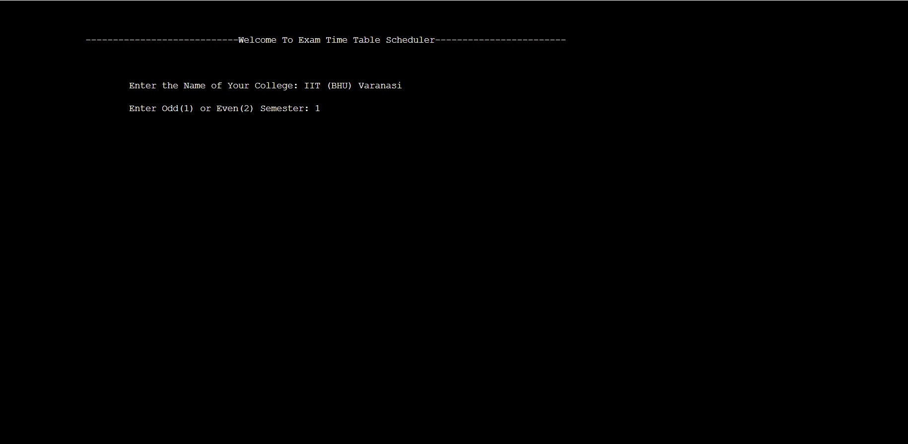
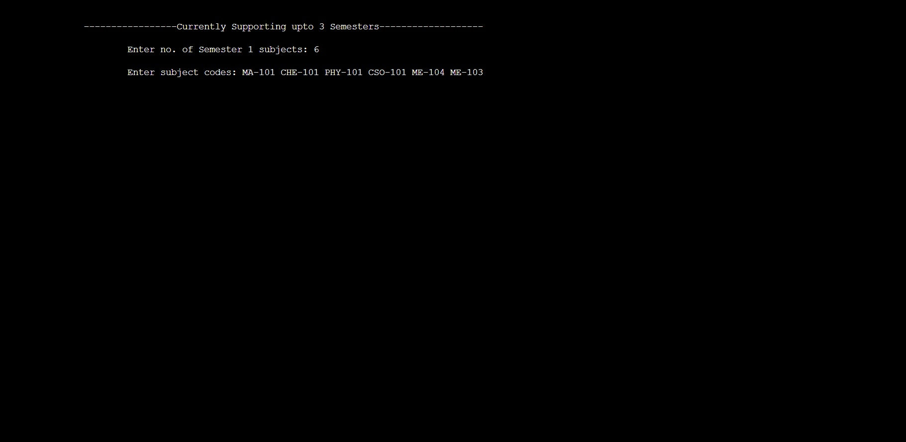
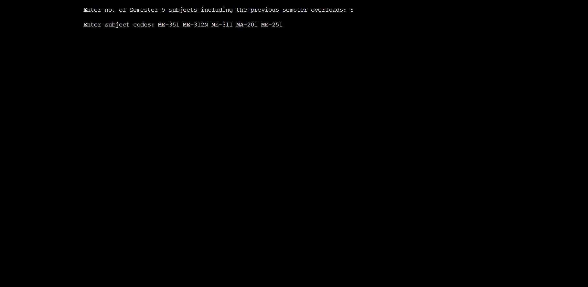
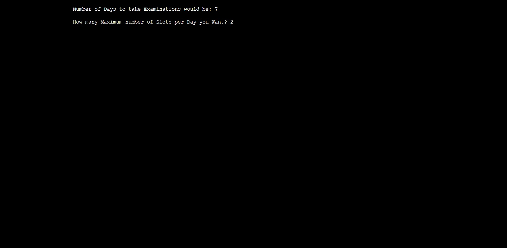
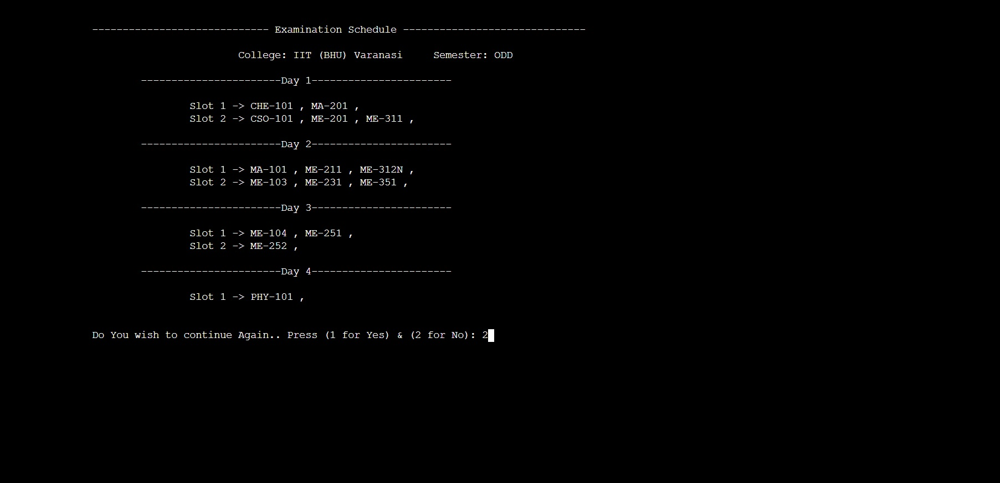

# 📅  Exam Time-Table-Generator

Exam Time-Table Generator is simple and easy to use application which takes Semester Subjects and Maximum number of slots as input from the user and displays the Schedule for examination with no subjects of same semester clashing in slot. 
The Application utilizes the Concepts of Graph and Graph coloring algorithm to generate a schedule for examination. 

> ## Problem ❓

Exam time table is required in every educational institution. In every semester or year, the universities and colleges are required to generate exam time table for conducting the internal and the final semester exams. 
The presence of vast numbers of offered courses makes it difficult to schedule exams in a limited epoch of time and often leads to clashing subjects of Subjects for similar semesters.

> ## Proposed Solution 💡

Graph coloring is one decent approach which can deal with timetable scheduling problem and can satisfy changing requirements. 
In this work, we have framed a systemic model by applying graph vertex coloring approach for generating exam timetabling with the help of a course matrix generated from given data of an educational institute.
For Every Adjacent Vertex we gave it different color so that it doesn't clashes in same slot. 

**Time Complexity of Algorithm: O(n2)**

**Space Complexity of Algorithm: O(n2)** , where, n is number of Subjects 

> ## Build With 

- HTML, CSS, Javascript (Front-End) User Interface Web Application (Currenty in Progress) 
- C++ (Backend Applicaton) 

> ## Our Progress 📈
- We have implemented the algorithm and made Working C++ Application for use (screenshots Attached) 
- Currently we are working on UI part by building up Web Application accessible to all people across globe. 

> ## Usage

__For Using the C++ Application__

#### Prerequisites 
1. Should have installed [MingW](https://www.mingw-w64.org/)
2. Editor VS Code/Turbo C++, etc.

Now, 

1. Clone the repository `git clone https://github.com/pranshukas/Exam-Time-Table-Generator.git`
2. Head over to cloned repository `cd Exam-Time-Table-Generator/`
3. Open the main.cpp in Editor and compile the Program `start main.cpp` or `code main.cpp`

> ## Screenshots of the Project 📸

> ## Further Scope 😃

48hr Hackathon was short period of time for us to think, approach and implement a Solution. We tried our best at creating C++ Application to be used, and are working on UI of Web Application and would shift it to Javascript. Web Application could be freely accesed by anyone globally on internet and would be more easy to use. 

Current Algorithm support 3 Semesters per Academic Year, We would be improvising the Algorithm with better complexity and supports more constraints. 

Our Future Goals also includes creating Web Application where user can not only generate Schedule but also can print the same in PDF format, mail the same to Emailids. 

> ## Made By 📖

- [Pranshu Kashyap](https://pranshu-resume.netlify.app/)
- [Aman Kumar](https://github.com/dev-it-aman)
